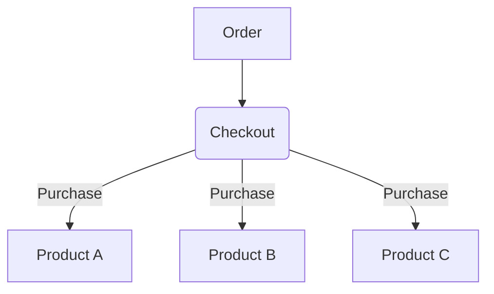
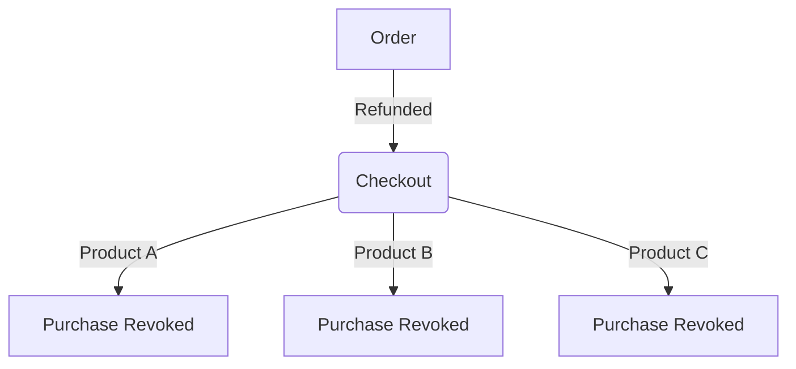

Integrating with sophisticated pricing structures can be complex. SureCart abstracts away many of the complexities of integrating with a purchase. This is done by extending our integration PHP class and providing the necessary functionality for a purchase's life-cycle events.

In short, you do not need to know or even understand how the entire SureCart system works. Instead, you can use a declarative approach and implement what you want to do when a purchase is created, invoked, or revoked.

## Purchases

A purchase is the state of what a customer currently should have "access" to. This includes one-time prices, subscriptions or installment plans. A purchase is directly tied 1:1 to a product, price and optionally a variant.



# Purchase Lifecycle

A purchase has 3 lifecycle events: created, invoked, and revoked. Each event has a corresponding action that can be implemented in your integration.

### Purchase Created

A purchase is created the first time a customer completes an order, or when a person upgrades or downgrades a subscription. A purchase can also be created when a customer makes a one-time purchase. Typically, this is when an integration provides "access" to something.

### Purchase Revoked

A purchase can be revoked either manually by the Merchant or automatically. A purchase can be manually revoked if it is a one-time purchase. The merchant will see a "Revoke" button next to the purchase in the Merchant's admin panel. A purchase can also be automatically revoked. This can happen when a subscription is canceled or expired, but it can also occur when a customer changes their subscription plan, through an upgrade or downgrade, for instance. While a new purchase will be created, the old purchase will be revoked.



<Note>
  When a merchant revokes a purchase that is tied to a subscription, the
  subscription will be canceled when the purchase is revoked.
</Note>

### Purchase Invoked

A purchase is 'invoked' when a purchase has been previously revoked and then un-revoked. This is useful when a merchant wants to trigger a specific action when a purchase is reinstated, but not necessarily when it is first created.

A great example of this is a welcome email. Typically, you only want to send a welcome email the first time someone purchases a product, not when it is reinstated after being revoked.

Merchants cannot manually invoke a purchase tied to a canceled subscription. Instead, they must have the customer make a new purchase to create a new subscription.

To simplify, standardize, and ensure reliability in integrating with purchases, we offer a base class that you can extend for your integration. This class and the associated interfaces require you to provide essential details and methods to override for handling various purchase model lifecycle events.

In most cases, you can complete the entire integration within a single class or file. Extending this class also enables SureCart to display your integration in different user interfaces, allowing merchants to select it from a list of available integrations.

## Example: Creating A User Role Switcher

In this example, we will create a user role switcher integration. In this integration, when a purchase is created or invoked, we will assign a specific role to the customer. When a purchase is revoked, we will remove that role.

<Note title="Example Only">
  SureCart already includes this integration by default. We're providing this as
  an example so you can understand how to build your own integrations if needed.
</Note>

<Steps>
<Step title="Extend IntegrationService">
First, let's extend the IntegrationService class.
```php
<?php

namespace MyPlugin\Integrations;

use SureCart\Integrations\Contracts\IntegrationInterface;
use SureCart\Integrations\Contracts\PurchaseSyncInterface;
use SureCart\Integrations\IntegrationService;

class UserRoleChangeIntegration extends IntegrationService implements IntegrationInterface, PurchaseSyncInterface {
}

````
</Step>

<Step title=" Set the integration details">
Next, let's provide the details of our integration.
```php
	/**
	 * The name for the integration.
	 * Names have to be structured as namespace/integration-name, where namespace is the name of your plugin or theme.
	 *
	 * @return string
	 */
	public function getName() {
		return 'my-plugin/user-role-change';
	}

	/**
	 * Get the SureCart model used for the integration.
	 * Only 'product' is supported at this time.
	 *
	 * @return string
	 */
	public function getModel() {
		return 'product';
	}

	/**
	 * Get the integration logo url.
	 * This url needs to be an absolute url to png, jpg, webp or svg.
	 *
	 * @return string
	 */
	public function getLogo() {
		return esc_url_raw( trailingslashit( plugin_dir_url( __FILE__ ) ) . 'icon.svg' );
	}

	/**
	 * The display name for the integration in the dropdown.
	 * This is displayed in a dropdown menu when a merchant selects an integration.
	 *
	 * @return string
	 */
	public function getLabel() {
		return __( 'Change WordPress User Role', 'surecart' );
	}

	/**
	 * The label for the integration item that will be chosen.
	 * This is displayed in the second dropdown after a person selects your integration.
	 *
	 * @return string
	 */
	public function getItemLabel() {
		return __( 'Change User Role', 'surecart' );
	}

	/**
	 * Help text for the integration item chooser.
	 * Additional help text for the integration item chooser.
	 *
	 * @return string
	 */
	public function getItemHelp() {
		return __( 'Change the user role of the user who purchased the product.', 'surecart' );
	}
```
</Step>
<Step title="Populate the integration item chooser">
To ensure that the integration is displayed in the integration chooser, two functions must be provided: `getItems` and `getItem`. These functions are essential for populating the integration item chooser and enabling SureCart to retrieve individual items.

Items can be thought of as individual records. In this example, an item represents a role. If you were to build an integration with a specific post type, for example, the item would be a list of your post type posts.

Individual items are expected to be in this format:
```php
 [
	 'id' => 'item_id', // this is stored as the integration model's integration_id property.
	 'label' => 'Item Label', // this is shown as a display name for the user for the item.
 ]
```

#### GetItems

Let's create a `getItems` method and map all user roles to an array of item choices. As with the above, we want the savable `id` to be the role name, and the label to be the role display name.

The search term is also passed, so you can make sure you are querying relevant results. Since we return all roles, we do not need this term, but it would be helpful for querying posts, for example.

```php
	...
	/**
	 * Get item listing for the integration.
	 * These are a list of item the merchant can choose from when adding an integration.
	 *
	 * @param array $items The integration items.
	 * @param string $search The search term.
	 *
	 * @return array The items for the integration.
	 */
	public function getItems( $items = [], $search = '' ) {
		$roles          = [];
		$editable_roles = wp_roles()->roles;
		foreach ( $editable_roles as $role => $details ) {
			$sub['id']      = esc_attr( $role );
			$sub['label']   = translate_user_role( $details['name'] );
			$roles[ $role ] = $sub;
		}
		return $roles;
	}
	...
```

#### GetItem

The IntegrationInterface requires a `getItem` function. This function should return a single item choice, which is a single array in the item format noted above. In our case, we expect the `id` to be the role name, as that is what we defined in the `getItems` method.

```php
/**
* Get the individual item.
*
* @param string $id The item role.
*
* @return array The item for the integration.
*/
public function getItem( $id ) {
	return [
		'id'    => $id,
		'label' => wp_roles()->get_names()[ $id ],
	];
}
```
</Step>

<Step title="Change the role on Purchase lifecycle events">
Next, we'll implement the required functions for the `PurchaseSyncInterface`. These functions are run when a purchase lifecycle event takes place and will allow us to modify the user's role.

The parameter `$integration` contains an `integration_id` attribute. This is the same `id` that you've set above in the `getItem` and `getItems` methods.

```php
	...
	/**
	 * Add the role when the purchase is created.
	 *
	 * @param \SureCart\Models\Integration $integration The integrations.
	 * @param \WP_User                     $wp_user The user.
	 *
	 * @return boolean|void Returns true if the user course access updation was successful otherwise false.
	 */
	public function onPurchaseCreated( $integration, $wp_user ) {
		// make sure the role exists.
		$role_object = get_role( $integration->integration_id );
		if ( ! $role_object ) {
			return;
		}
		// add the role
		return $wp_user->add_role( $integration->integration_id );
	}

	/**
	 * Add the role when the purchase is invoked
	 *
	 * @param \SureCart\Models\Integration $integration The integrations.
	 * @param \WP_User                     $wp_user The user.
	 *
	 * @return boolean|void Returns true if the user course access updation was successful otherwise false.
	 */
	public function onPurchaseInvoked( $integration, $wp_user ) {
		// make sure the role exists.
		$role_object = get_role( $integration->integration_id );
		if ( ! $role_object ) {
			return;
		}
		// add the role
		return $wp_user->add_role( $integration->integration_id );
	}

	/**
	 * Remove a user role when the purchase is revoked.
	 *
	 * @param \SureCart\Models\Integration $integration The integrations.
	 * @param \WP_User                     $wp_user The user.
	 *
	 * @return boolean|void Returns true if the user course access updation was successful otherwise false.
	 */
	public function onPurchaseRevoked( $integration, $wp_user ) {
		// make sure the role exists.
		$role_object = get_role( $integration->integration_id );
		if ( ! $role_object ) {
			return;
		}
		// add the role
		return $wp_user->remove_role( $integration->integration_id );
	}
	...
```

This code can be further simplified for better readability and maintainability, as shown in the complete example below. However, the provided code gives you a basic idea of how to implement purchase syncing.

There are also other optional methods for handling specific purchase changes. For instance, if you want to modify something when the purchase quantity changes, you can use the `onPurchaseQuantityUpdated` method:

#### Quantity Changed

```php
	/**
	 * Method to run when the quantity updates.
	 *
	 * @param integer  $quantity The new quantity.
	 * @param integer  $previous_quantity The previous quantity.
	 * @param Purchase $purchase The purchase.
	 * @param array    $request The request.
	 *
	 * @return void
	 */
	public function onPurchaseQuantityUpdated( $quantity, $previous_quantity, $purchase, $request ) {
		// we are not using this, but you could if the purchase quantity is updated.
	}
```

If you want to perform specific actions when a purchase's product changes, such as when a subscription plan changes, you can utilize the `onPurchaseProductAdded` and `onPurchaseProductRemoved` methods. If you don't define these methods, by default, the `onPurchaseCreated` function and `onPurchaseRevoked` function will be called when a purchase is added or removed, respectively.

#### Product Added or Removed

```php
	/**
	 * When a product is added to a purchase. This can happen if a purchase is updated with a new product.
	 * THIS IS OPTIONAL. If you don't implement this method, the onPurchaseCreated method will be called.
	 *
	 * @param integer  $quantity The new quantity.
	 * @param integer  $previous The previous quantity.
	 * @param Purchase $purchase The purchase.
	 * @param array    $request The request.
	 *
	 * @return void
	 */
	public function onPurchaseProductAdded( $quantity, $previous, $purchase, $request ) {
		// if you do not add this, it will default to onPurchaseCreated
	}

	/**
	 * When a product is removed from purchase. This can happen if a purchase is updated with a new product.
	 * THIS IS OPTIONAL. If you don't implement this method, the onPurchaseRevoked method will be called.
	 *
	 * @param integer  $quantity The new quantity.
	 * @param integer  $previous The previous quantity.
	 * @param Purchase $purchase The purchase.
	 * @param array    $request The request.
	 *
	 * @return void
	 */
	public function onPurchaseProductRemoved( $quantity, $previous, $purchase, $request ) {
		// if you do not add this, it will default to onPurchaseRevoked
	}
```
</Step>

<Step title="Bootstrap the integration">
The final step in integrating your custom purchase syncing logic is to bootstrap your integration. This involves creating a new instance of your integration class and calling the bootstrap function to initialize it.

```php
(new \MyPlugin\Integrations\UserRoleChangeIntegration())->bootstrap();
```
</Step>
</Steps>

## Full Example

Below is the complete example with some refactoring to provide you with a comprehensive idea of how to implement a complete integration:

```php expandable
<?php

namespace MyPlugin\Integrations;

use SureCart\Integrations\Contracts\IntegrationInterface;
use SureCart\Integrations\Contracts\PurchaseSyncInterface;
use SureCart\Integrations\IntegrationService;

/**
 * Controls the LearnDash integration.
 */
class UserRoleChangeIntegration extends IntegrationService implements IntegrationInterface, PurchaseSyncInterface {
	/**
	 * Get the slug for the integration.
	 *
	 * @return string
	 */
	public function getName() {
		return 'my-plugin/user-role-change';
	}

	/**
	 * Get the SureCart model used for the integration.
	 * Only 'product' is supported at this time.
	 *
	 * @return string
	 */
	public function getModel() {
		return 'product';
	}

	/**
	 * Get the integration logo url.
	 * This can be to a png, jpg, or svg for example.
	 *
	 * @return string
	 */
	public function getLogo() {
		return esc_url_raw( trailingslashit( plugin_dir_url( __FILE__ ) ) . 'icon.svg' );
	}

	/**
	 * The display name for the integration in the dropdown.
	 *
	 * @return string
	 */
	public function getLabel() {
		return __( 'Change WordPress User Role', 'surecart' );
	}

	/**
	 * The label for the integration item that will be chosen.
	 *
	 * @return string
	 */
	public function getItemLabel() {
		return __( 'Change User Role', 'surecart' );
	}

	/**
	 * Help text for the integration item chooser.
	 *
	 * @return string
	 */
	public function getItemHelp() {
		return __( 'Change the user role of the user who purchased the product.', 'surecart' );
	}

	/**
	 * Get item listing for the integration.
	 * These are a list of item the merchant can choose from when adding an integration.
	 *
	 * @param array $items The integration items.
	 * @param string $search The search term.
	 *
	 * @return array The items for the integration.
	 */
	public function getItems( $items = [], $search = '' ) {
		$roles          = [];
		$editable_roles = wp_roles()->roles;
		foreach ( $editable_roles as $role => $details ) {
			$sub['id']      = esc_attr( $role );
			$sub['label']   = translate_user_role( $details['name'] );
			$roles[ $role ] = $sub;
		}
		return $roles;
	}

	/**
	 * Get the individual item.
	 *
	 * @param string $role The item role.
	 *
	 * @return array The item for the integration.
	 */
	public function getItem( $role ) {
		return [
			'id'    => $role,
			'label' => wp_roles()->get_names()[ $role ],
		];
	}

	/**
	 * Add the role when the purchase is created.
	 *
	 * @param \SureCart\Models\Integration $integration The integrations.
	 * @param \WP_User                     $wp_user The user.
	 *
	 * @return boolean|void Returns true if the user course access updation was successful otherwise false.
	 */
	public function onPurchaseCreated( $integration, $wp_user ) {
		$this->toggleRole( $integration->integration_id, $wp_user, true );
	}

	/**
	 * Add the role when the purchase is invoked
	 *
	 * @param \SureCart\Models\Integration $integration The integrations.
	 * @param \WP_User                     $wp_user The user.
	 *
	 * @return boolean|void Returns true if the user course access updation was successful otherwise false.
	 */
	public function onPurchaseInvoked( $integration, $wp_user ) {
		$this->onPurchaseCreated( $integration, $wp_user );
	}

	/**
	 * Remove a user role when the purchase is revoked.
	 *
	 * @param \SureCart\Models\Integration $integration The integrations.
	 * @param \WP_User                     $wp_user The user.
	 *
	 * @return boolean|void Returns true if the user course access updation was successful otherwise false.
	 */
	public function onPurchaseRevoked( $integration, $wp_user ) {
		$this->toggleRole( $integration->integration_id, $wp_user, false );
	}

	/**
	 * Toggle the role
	 *
	 * @param string   $role The role.
	 * @param \WP_User $wp_user  The user object.
	 * @param boolean  $add  True to add the role, false to remove.
	 *
	 * @return \WP_Role|false
	 */
	public function toggleRole( $role, $wp_user, $add = true ) {
		// make sure the role exists.
		$role_object = get_role( $role );
		if ( ! $role_object ) {
			return;
		}
		// add or remove the role.
		return $add ? $wp_user->add_role( $role ) : $wp_user->remove_role( $role );
	}
}

// bootstrap the integration.
(new \MyPlugin\Integrations\UserRoleChangeIntegration())->bootstrap();
```
````
